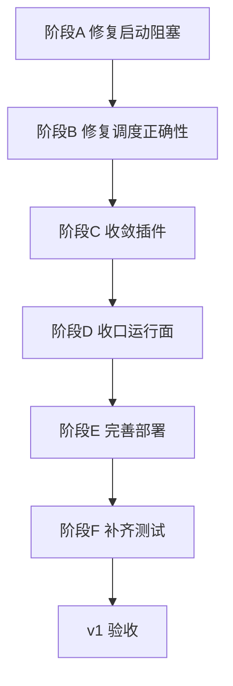

# KeyFlow 执行清单

> 更新时间：2026-03-20
> 用途：作为后续直接执行的阶段清单，按勾选推进。

## 1. 执行原则

```text
账户归核心，状态归核心，调度归核心；
供应商差异归插件，可用性判断归插件；
v1 先做稳定调度，不做统一额度经济模型。
```

### 边界

- 做：provider 内凭证调度、核心状态机、账户 CRUD、内部接口、cooldown 恢复
- 不做：provider fallback、task routing、全局 model 选择、统一 quota/balance 核心评分

---

## 2. 当前状态

### 已有基础

- [x] `DDD + CQRS + FastAPI + Redis + PostgreSQL + 插件` 骨架
- [x] `ApiKey / KeyStatus / KeyScheduler / KeyScorer / KeyStateMachine`
- [x] 内部接口：`allocate-key / report-error / report-success`
- [x] 管理接口：`POST/GET/PUT/DELETE`
- [x] `RedisKeyCache`、Lua 脚本、SQLAlchemy 仓储
- [x] 基础插件骨架
- [x] `/health`
- [x] `Dockerfile`
- [x] 后台任务：`recover_cooldowns` / `refresh_keys` 由 **sidecar worker** 周期执行（`src/worker_main.py`）
- [x] 基础测试

### 当前结论

- 当前处于：主链路、Redis+Lua 并发、依赖感知的 `/health`、Docker 运行时说明已对齐；PostgreSQL 仓储集成测试已在 Docker 网络内通过，但宿主机默认地址在本机仍受环境/端口影响；若存在 opt-in 外网集成类测试资产，全量 `pytest` 可能不稳定
- 已确认：`tests/test_api.py`、`tests/test_provider_plugins.py` 当前全绿
- 已完成：核心凭证模型已从单字符串 `api_key` 重构为结构化 `credential: dict[str, str]`
- 若仓库或分支中加入「导入即访问外网 / 依赖本地密钥」的 provider 集成测试或手工脚本，不应纳入默认稳定回归；本 worktree 当前 `tests/` 以 README 中 targeted 集合与全量清单为准
- **Redis + Lua 真实并发**：`tests/test_redis_lua_integration.py` 在默认 `redis://localhost:6379/9` 可达时可通过（验证租约下并发不重复分配）。
- **PostgreSQL 仓储集成**：`tests/test_postgres_repository_integration.py` 已存在；本次已通过 Docker 网络内 PostgreSQL 实测（`keyflow-postgres`，`2 passed`）。**宿主机默认 `127.0.0.1:5432` 在本机仍可能因环境/端口问题失败**；可通过 `KEYFLOW_INTEGRATION_PG_URL` / `KEYFLOW_PG_ADMIN_URL` 等指向目标实例。
- **`/health`**：非固定静态体；返回 `status` + `checks`（`app` / `database` / `redis`），依赖失败时可为 `503` + `degraded`（见 `tests/test_api.py` 中 health 用例）。
- **Docker 本地验证**：`README.md` 提供分步启动与手动检查说明；实际验证由人工执行，不再保留单独 smoke 脚本资产。
- **运行时口径**：`v1` 采用**单镜像双运行时**；API 负责 HTTP，worker 负责轻量周期刷新；本地 Docker 为同一 compose stack 的两个服务，生产目标为 **same Pod, two containers**，共享 PostgreSQL + Redis 真相源。

---

## 3. P0 阻塞项

- [x] 修复 `container.container` 向 `ScoreWeights` 传入不存在的 `quota` 字段
- [x] 修复 `KeyStateMachine.on_error()` 调用不存在的 `key.is_exhausted()`
- [x] 修复 `allocate` 路由未向服务层透传 `model`
- [x] 修复 Lua 分配脚本缺少占用/租约语义，避免并发重复分配

规则：

- 先修会启动失败的问题
- 再修会错分配的问题

---

## 4. 阶段执行清单

### 阶段 A：修复运行阻塞

目标：先让默认启动路径可靠。

- [x] 修正 `ScoreWeights` 配置装配
- [x] 修正状态机错误路径
- [x] 验证 `main.py -> create_app() -> create_container()` 可启动
- [x] 补充对应测试

完成标准：

- [x] 默认启动不因容器装配失败
- [x] `report-error` 能处理普通错误类型
- [x] 测试覆盖上述路径

### 阶段 B：补齐调度正确性

目标：让分配结果与文档边界一致。

- [x] `allocate-key` 透传 `model`
- [x] 插件可用性判断接入 `model`
- [x] 本地 `supported_models` 参与辅助过滤
- [x] Lua 增加原子占用机制
- [x] 明确定义分配后的回写语义

回写语义（当前实现）：

- `allocate-key` 成功后写入短租约（lease）避免并发重复分配
- `report-success` / `report-error` 完成核心状态回写后释放该 key 的租约
- 若未回写，租约按 `ALLOCATE_LEASE_SECONDS` 自动过期

完成标准：

- [x] 请求带 `model` 时不会分配明显不支持的凭证
- [x] 并发请求不会重复拿到同一个 key
- [x] 分配与回写路径一致

### 阶段 C：收敛插件系统

目标：把插件从骨架变成可支撑 `v1` 的适配层。

- [x] 统一 `fetch_models / is_credential_available / explain_credential`
- [x] 明确插件错误处理约定
- [x] 区分静态模型列表与远端探测插件
- [x] 明确 Gemini Web Proxy 的依赖与降级策略

实现约定（当前）：

- 插件统一声明 `PLUGIN_VERSION / PLUGIN_INTERFACE_VERSION`
- `ProviderRegistry` 注册时校验 `PLUGIN_INTERFACE_VERSION`，不兼容即拒绝加载
- `get_key_explain` 统一插件异常降级为 `plugin_error`，避免接口层抛出插件细节异常
- 通过 `model_source` 区分 `remote/static`；`gemini-web-proxy` 为 `static`
- `gemini-web-proxy` 作为标准 provider 插件统一注册；缺依赖时按不可分配降级

完成标准：

- [x] 新增账户时可同步模型列表
- [x] 分配时插件可用性判断稳定可调用
- [x] `explain` 不泄露敏感凭证

### 阶段 D：收口运行面

目标：补齐运行保障能力，并保持单程序入口。

- [x] 冷却恢复能力可用
- [x] 补齐独立 worker 程序入口
- [x] quota sync 继续移出 `v1`

实现约定（当前）：

- 冷却恢复与刷新由 `src/worker_main.py` 驱动的 sidecar worker 周期处理
- 运行面保持单镜像双命令：`uvicorn main:app --app-dir src` + `python src/worker_main.py`
- quota sync 继续移出 `v1` 范围，不保留伪实现入口

完成标准：

- [x] cooldown 恢复稳定运行
- [x] 存在独立 worker 入口，且与 API 保持同一部署单元
- [x] quota sync 若进入 `v1`，必须以真实逻辑进入，而不是占位程序

### 阶段 E：完善部署件

目标：具备最小可运行部署形态。

- [x] 完整 `docker-compose.yml`
- [x] 补齐单应用容器部署件（`redis + postgres` 使用外部服务）
- [x] 补齐 `.env.example`
- [x] 补齐启动说明

实现约定（当前）：

- compose 拆分为：
  - `docker/src/docker-compose.yml`（`keyflow-api`）
  - `docker/postgresql/docker-compose.yml`
  - `docker/redis/docker-compose.yml`
- `.env.example` 默认使用外部服务地址（示例为 `localhost`，可按环境覆盖）；默认 `UVICORN_WORKERS=1`，并提供 `BACKGROUND_TASK_INTERVAL_SECONDS`
- DB 初始化策略：API 启动时自动执行表存在性检查并创建缺失表（`create_all` 幂等）
- API 健康检查：`/health`

完成标准：

- [x] 本地可通过 Docker 启动应用容器并连接外部依赖
- [x] `healthcheck` 正常
- [x] 数据库初始化路径清晰

### 阶段 F：补齐测试与验收

目标：用自动化测试固化 `v1`。

- [x] 默认启动路径测试
- [x] 状态机异常路径测试
- [x] Lua 并发分配测试（真实 Redis + Lua，见 `tests/test_redis_lua_integration.py`）
- [x] 带 `model` 的分配测试
- [x] CRUD 回归测试
- [x] 后台循环基础测试

当前已验证：

- `tests/test_api.py` 覆盖：默认启动、普通错误路径、带 `model` 分配、CRUD、provider 列表、`explain` 安全返回、API `lifespan` 不再自启后台循环，以及 **`/health` 依赖探测**（就绪 / 降级 `503`）
- `tests/test_worker_runtime.py` 覆盖：worker 单次迭代顺序、阶段失败容错、入口读取 `BACKGROUND_TASK_INTERVAL_SECONDS`
- `tests/test_provider_plugins.py` 覆盖：`gemini-web-proxy` 静态模型、依赖降级、双 cookie 校验与初始化，`openrouter` 的 `explain_credential` 脱敏说明
- `tests/test_redis_lua_integration.py`：真实 Redis 下并发分配不重复（租约语义）
- `tests/test_postgres_repository_integration.py`：真实 PostgreSQL 下仓储 round-trip 与并发 claim；本次在 Docker 网络 `keyflow_keyflow-network` 内以 `keyflow-postgres` 为目标实测 **2 passed**
- `README.md`：记录本地分步启动与人工检查路径，不再维护独立 smoke 脚本契约测试

当前未验证 / 环境敏感：

- 全量 `pytest` 在包含 opt-in 外网集成类测试时仍可能不稳定（见 README 测试建议）
- PostgreSQL 集成：宿主机默认地址在本机可能不可用，需按测试文件说明配置 `KEYFLOW_*`；当前已验证 Docker 网络内 PostgreSQL 路径可通过

完成标准：

- [x] 覆盖“能启动、能分配、能回写、能恢复”
- [ ] 默认回归套件治理与固定环境前提已收口（如外网依赖类测试的 opt-in 定位、PostgreSQL 集成环境固化）；**该项属于测试资产 / 环境治理，不与当前 v1 代码与运行时验收相矛盾**

---

## 5. v1 验收清单

### 核心能力

- [x] 可启动的 API 服务
- [x] provider 内凭证分配
- [x] 成功/失败回写
- [x] 限流退避与 cooldown 恢复
- [x] 管理端账户 CRUD
- [x] 插件可用性判断
- [x] Redis 原子分配（Lua + 租约；集成见 `tests/test_redis_lua_integration.py`）
- [x] PostgreSQL 持久化（仓储集成见 `tests/test_postgres_repository_integration.py`；Docker 网络内已验证通过，宿主机默认地址仍取决于环境）

### 接口能力

- [x] `POST /api/internal/allocate-key`
- [x] `POST /api/internal/report-error`
- [x] `POST /api/internal/report-success`
- [x] `POST /api/providers/{provider}/keys`
- [x] `GET /api/providers/{provider}/keys`
- [x] `PUT /api/keys/{id}`
- [x] `DELETE /api/keys/{id}`
- [x] `GET /health`

### 工程能力

- [x] `.env` 配置可驱动运行（见 `.env.example`；应用与 compose 约定在 `README.md`）
- [x] Docker 本地联调（拆分 compose + 原有 `start_*` / `stop_*` 脚本）
- [x] 基础自动化测试
- [x] sidecar worker 周期执行 cooldown 恢复与 refresh；API 不再拥有后台循环

---

## 6. 暂不纳入 v1

- [ ] 跨 provider fallback
- [ ] 全局 task 路由
- [ ] 统一的余额/价格/剩余量核心评分模型
- [ ] 插件自动创建新凭证
- [ ] 成本优化调度
- [ ] SLA 调度
- [ ] 全局控制平面

---

## 7. 推荐顺序



---

## 8. 当前推进建议

下一步默认执行：

1. 治理外网依赖类测试资产：保持从默认 `pytest` 套件隔离，或改为显式 opt-in / 手工脚本
2. 在目标 CI 或 Docker 网络中为 `tests/test_postgres_repository_integration.py` 固定 PostgreSQL 前提，避免宿主机端口冲突

一句话：

```text
核心依赖类证明与运行面文档已收口；剩余主要是外部脚本治理与 CI 数据库前提。
```
