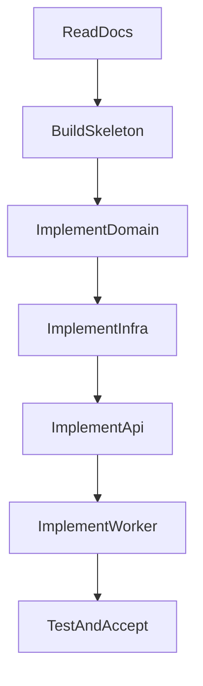

# KeyFlow 开发计划

## 1. 项目定位

### 1.1 项目名称
- 项目名：`KeyFlow`
- 系统角色：`Provider Scoped Key Scheduling Service`

### 1.2 系统职责
- 在单个 `provider` 范围内完成 API Key 调度。
- 管理 Key 生命周期状态，包括限流、冷却、禁用、耗尽。
- 为上游 `AI Router / Model-Forward` 提供稳定的内部分配接口。

### 1.3 非职责边界
- 不负责 `provider fallback`
- 不负责 `task routing`
- 不负责 `model` 选择
- 不负责直接执行 LLM 请求

结论：`KeyFlow` 不是简单的 key 管理工具，而是任务执行链路中的资源调度核心组件。

## 2. 技术约束

### 2.1 运行时约束
- Python 版本：`Python 3.13`
- Docker 基础镜像：`python:3.13-slim-bookworm`
- 默认数据库：`PostgreSQL 17`
- 默认缓存：`Redis`

### 2.2 架构约束
- 采用 `DDD + CQRS`
- 接口层仅使用 `FastAPI`
- 调度高并发路径必须基于 `Redis + Lua`
- 持久化使用 `PostgreSQL`
- 依赖方向必须保持单向：`interfaces -> application -> domain`，`infrastructure` 为外部实现层

### 2.3 工程约束
- 敏感信息通过 `.env` 管理，不进入仓库
- 配置项必须可参数化，不能把权重、冷却时间、限流参数硬编码在业务逻辑中
- 代码结构优先复用文档中已确认的分层和命名

## 3. 目录规划

依据 `docs/代码结构.md`，后续开发目录建议固定如下：

```text
keyflow/
├── src/
│   ├── domain/
│   ├── application/
│   ├── infrastructure/
│   ├── interfaces/
│   ├── container/
│   └── main.py
├── tests/
├── docs/
├── scripts/
├── docker/
├── pyproject.toml
├── README.md
├── .env.example
└── .env
```

### 3.1 各层职责
- `domain`：纯调度核心，不依赖 Redis、数据库、FastAPI
- `application`：编排用例，承接 CQRS
- `infrastructure`：Redis、PostgreSQL、配置、日志、插件实现
- `interfaces`：HTTP API、请求响应模型、中间件
- `container`：依赖注入与对象装配

## 4. 核心模型设计

### 4.1 账户模型
- 本项目中 `api-key` 本身就是账户，不再额外抽象“账户名 + secret”双层结构。
- 一条账户记录至少包含：
- `id`
- `provider`
- `api_key`
- `status`
- `supported_models`
- `last_used_at`
- `error_count`
- `cooldown_until`
- `balance_info`
- `pricing_info`
- `remaining_quota_by_model`

### 4.2 账户管理原则
- `POST /providers/{provider}/keys` 本质上是“给指定供应商添加一个 api-key 账户”。
- 不应要求用户传 `display_name`、`secret`、`quota_total` 这类与当前语义冲突或不稳定的字段。
- 创建账户时最小输入应围绕 `api_key` 展开，其余信息由供应商插件探测或后台同步获得。

### 4.3 Key 状态机
- `AVAILABLE`
- `RATE_LIMITED`
- `COOLDOWN`
- `DISABLED`
- `EXHAUSTED`

### 4.4 状态迁移原则
- 成功调用：增加成功计数，更新使用时间，必要时更新额度
- 普通错误：增加错误计数，降低调度优先级
- `rate_limit`：进入冷却或限流状态，并设置退避时间
- 额度耗尽：进入 `EXHAUSTED`
- 人工禁用：进入 `DISABLED`

## 5. 调度算法方案

依据 `docs/调度算法.md`，采用动态加权调度：

```text
score =
  w1 * quota_score
+ w2 * idle_score
+ w3 * success_score
- w4 * error_penalty
- w5 * rate_limit_penalty
- w6 * cooldown_penalty
```

### 5.1 评分维度
- `quota_score`：应基于插件同步回来的余额、模型价格、剩余可用量计算，不能要求用户手工输入固定 `quota_total`
- `idle_score`：闲置时间越长，优先级越高
- `success_score`：历史成功率越高，优先级越高
- `error_penalty`：错误越多，惩罚越高
- `rate_limit_penalty`：出现 429 时快速降权
- `cooldown_penalty`：冷却期内直接不可选或极低优先级

### 5.2 调度流程
1. 根据 `provider` 获取候选 key
2. 过滤 `DISABLED / COOLDOWN / EXHAUSTED`
3. 计算动态分数
4. 按分数排序
5. 使用 `Redis + Lua` 进行原子校验和占用
6. 返回可用 key
7. 上游请求完成后通过成功或失败接口回写状态

### 5.3 算法目标
- 可控：权重、阈值、退避策略都可配置
- 可调：方便后续针对不同 provider 调参
- 可观测：后续可接入指标体系

## 6. Redis 与 PostgreSQL 设计

### 6.1 Redis 设计
Redis 用于高并发实时调度。

建议结构：
- `ZSET provider:{provider}:keys`
- `key_status:{key}`
- `key_usage:{key}`
- `key_cooldown:{key}`

作用：
- 保存调度排序信息
- 快速判断 key 当前可用状态
- 使用 Lua 保证分配过程原子化

### 6.2 PostgreSQL 设计
PostgreSQL 17 用于持久化和管理能力。

负责内容：
- 账户记录（`api-key` 即账户）
- Provider 配置
- 插件探测结果（支持模型、余额、价格、剩余可用量）
- 管理接口查询
- 历史状态与长期记录

### 6.3 职责边界
- Redis：高频读写、临时状态、原子调度
- PostgreSQL：管理面、持久层、可审计数据

## 7. API 规划

### 7.1 内部接口
- `POST /internal/allocate-key`
- `POST /internal/report-error`
- `POST /internal/report-success`

### 7.2 管理接口
- `POST /providers/{provider}/keys`：添加指定供应商的 `api-key` 账户
- `GET /providers/{provider}/keys`：查询指定供应商下的账户池
- `PUT /keys/{id}`：修改指定账户
- `DELETE /keys/{id}`：删除指定账户

### 7.3 管理接口约束
- `api-key` 就是账户，不应再设计 `display_name + secret` 的双层语义。
- 创建和修改账户时，不应把 `quota_total` 作为前端手填字段。
- 接口返回应包含插件同步得到的 `supported_models`、余额/价格摘要或剩余量摘要。

### 7.4 安全要求
- 通过请求头 `X-Internal-Key` 保护内部接口
- 后续可扩展为更完整的内部鉴权机制

## 8. 插件系统规划

### 8.1 插件定位
- 一个插件就是一个供应商，不是“协议兼容层”。
- `openai.py` 只代表 OpenAI 官方。
- `anthropic.py` 只代表 Anthropic 官方。
- `openrouter.py` 只代表 OpenRouter。
- 特殊供应商应单独实现独立插件。

### 8.2 插件必须提供的能力
- 获取支持模型列表
- 余额查询
- 模型价格查询
- 根据余额和不同模型价格换算剩余可用量
- 健康检查与账户可用性探测
- 错误类型映射，驱动 `RATE_LIMITED / COOLDOWN / EXHAUSTED` 等状态变化

### 8.3 当前问题
- 仅实现 `fetch_models()` 不能算完成插件系统。
- 仅有插件文件存在但未真正接入服务层，也不能算完成插件化。
- `gemini_web_proxy` 当前实现方向错误，应按库适配重新设计，而不是伪装成 HTTP 服务。

## 9. 后台任务规划

需要预留 `worker` 能力，至少包含：
- 健康检查：验证 key 是否仍可用
- 冷却恢复：定期扫描并恢复到可调度状态
- 额度同步：将 provider 额度使用情况回写系统

## 10. 开发分阶段计划

### 阶段1：基础骨架
目标：先把工程骨架搭稳

输出：
- `pyproject.toml`
- `src` 分层目录
- `main.py`
- 配置模块
- Docker 基础文件
- `.env.example`

验收标准：
- 能在 `Python 3.13` 环境启动基础应用
- Docker 基础镜像固定为 `python:3.13-slim-bookworm`

### 阶段2：领域层实现
目标：完成调度核心，不混入基础设施细节

输出：
- `ApiKey` 实体（`api-key` 即账户）
- `KeyStatus`
- `Provider`
- `scheduler.py`
- `scorer.py`
- `state_machine.py`
- 仓储抽象接口

验收标准：
- 领域层可以独立测试
- 不依赖 FastAPI、Redis、PostgreSQL 实现细节

### 阶段3：基础设施实现
目标：完成 Redis 调度链路、PostgreSQL 持久化、插件系统接线

输出：
- Redis 客户端与缓存实现
- Lua 原子分配脚本
- PostgreSQL 17 数据模型
- 仓储实现
- 配置与日志
- 插件注册表
- 官方供应商插件
- 插件调用结果持久化

验收标准：
- 能完成一次原子调度
- 不会并发分配同一个 key

### 阶段4：应用层与接口层
目标：打通外部请求到内部领域逻辑

输出：
- `allocate-key` 查询用例
- `report-error` 命令
- `report-success` 命令
- 账户管理接口用例
- 请求响应模型
- 中间件和依赖注入

验收标准：
- 内部接口可用
- 管理接口可完成供应商下 `api-key` 账户生命周期维护

### 阶段5：后台任务与部署
目标：补齐运行保障能力

输出：
- worker
- `docker-compose`
- 基础部署说明

验收标准：
- 本地可通过 Docker 启动 `api + redis + postgresql`
- worker 可独立运行

### 阶段6：测试与验收
目标：保障核心链路稳定

测试优先级：
- 调度器评分与排序
- 状态机迁移
- Redis Lua 并发安全
- 接口回归
- 冷却恢复与额度同步
- 插件余额/价格/剩余量同步
- 账户管理 CRUD

验收标准：
- 核心能力全部可测
- 满足 `docs/任务书.md` 中列出的必须完成项

## 11. 推荐开发顺序



## 12. 当前实现差距

- 目前代码把 `display_name + secret` 当成账户结构，这与“`api-key` 就是账户”的共识冲突。
- 目前插件系统仅完成了文件骨架和局部接线，不具备余额、价格、剩余量、健康检查等核心供应商能力。
- `quota_total` 被错误地暴露成创建账户时的输入字段，后续应改为系统内部同步状态。
- `plan.md` 之前被错误标记为“已完成”，现已回退为真实待办状态。
- `gemini_web_proxy` 供应商实现方向错误，需要重新建模。

## 13. 关键风险

- 如果领域逻辑提前耦合 Redis 或数据库，实现会迅速失控
- 如果 Lua 原子分配没有做好，并发下会重复拿到同一个 key
- 如果状态机定义不完整，错误上报和恢复机制会产生脏状态
- 如果把 fallback 放进 APS，会破坏系统职责边界
- 如果插件只做模型列表而不负责余额/价格/剩余量，同步与调度都会失真

## 14. 验收清单

### 核心能力
- [ ] Key 调度（`domain/services/scheduler.py` + `scorer.py`）
- [ ] 状态机（覆盖 AVAILABLE / RATE_LIMITED / COOLDOWN / DISABLED / EXHAUSTED）
- [ ] 限流与熔断（退避策略：1min → 2min → 5min → 10min）
- [ ] Redis Lua 并发安全（`infrastructure/cache/lua/allocate.lua`）

### 接口能力
- [ ] `POST /api/internal/allocate-key`
- [ ] `POST /api/internal/report-error`
- [ ] `POST /api/internal/report-success`
- [ ] 管理接口（`POST/GET /providers/{provider}/keys`，`PUT/DELETE /keys/{id}`）
- [ ] `GET /health`（K8s liveness/readiness 探针）

### 架构能力
- [ ] DDD 分层（`domain / application / infrastructure / interfaces / container`）
- [ ] CQRS 拆分（`application/queries/` + `application/commands/`）
- [ ] Redis + PostgreSQL 17 读写分离（`DATABASE_URL_READ` / `DATABASE_URL_WRITE`）
- [ ] 插件扩展位（`infrastructure/plugins/base.py` + `providers/`）
- [ ] 插件系统真正接线到账户管理和同步链路

### 部署能力
- [ ] Docker Compose
- [ ] Docker 健康检查（`/health` 探针，`healthcheck` 配置）
- [ ] K8s 兼容（健康探针、无状态 API 容器、环境变量注入）

### 工程保障
- [ ] 周期调度 worker（`workers/health_check_worker.py`）
- [ ] DB 初始化脚本（`scripts/init_db.py`）
- [ ] 配置全部参数化（仅限基础设施配置，不包含供应商业务数据）
- [ ] 核心链路测试

### 供应商插件能力
- [ ] 获取支持模型列表
- [ ] 余额查询
- [ ] 模型价格查询
- [ ] 根据余额和价格换算剩余可用量
- [ ] 健康检查
- [ ] `quota_sync_worker` 真实同步逻辑

## 15. 最终结论

后续开发应围绕一句话展开：

`api-key 即账户，调度算法在 domain，性能核心在 Redis，供应商差异封装在插件，余额/价格/剩余量由插件同步回写。`

当前 `docs/plan.md` 的目标是作为后续重构和补实现的统一基线；在插件系统、账户语义、额度同步、接口定义修正完成前，不能再将该计划视为“已完成”。
